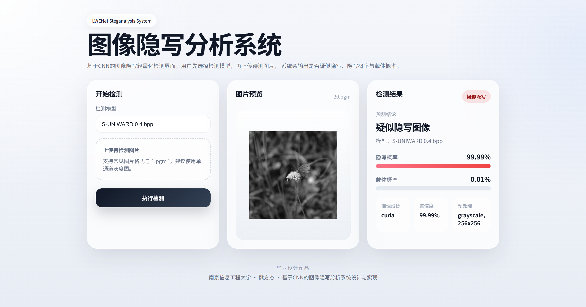

# 基于 CNN 的图像隐写分析系统

声明：本项目中的LWENet实现来源于：https://github.com/Chen122975/LWENet

本项目面向毕业设计“基于 CNN 的图像隐写分析系统设计与实现”，以 `LWENet` 为核心检测模型，围绕 `BOSSBase` 及其对应的 `S-UNIWARD`、`WOW` 隐写图像数据开展训练、测试、评估与系统实现工作。

项目当前包含两部分内容：

1. 模型训练与实验评估
2. 面向用户的本地图像隐写分析网页系统



## 1. 项目介绍

图像隐写分析的目标是判断一张图像是否经过隐写嵌入处理。本项目采用 `LWENet` 对灰度图像进行二分类检测，将图像分为：

- 原始载体图像
- 隐写图像

当前仓库中的实验主要围绕以下设置展开：

- 数据集：`BOSSBase`
- 隐写算法：`S-UNIWARD`、`WOW`
- 嵌入率：当前仓库中已保存 `0.2 bpp`、`0.4 bpp` 的部分实验结果
- 模型：`LWENet`

此外，在现有训练代码基础上，项目还补充了：

- 训练日志解析与论文图表导出脚本
- 单模型测试集评估脚本
- 支持单图上传检测的网页系统

## 2. 项目目录

当前仓库主要目录和文件说明如下：

- `LWENet.py`
  `LWENet` 模型结构定义文件。

- `pre_train_pair_conv_net.py`
  原始训练脚本，用于模型训练、验证和测试，并保存每个 epoch 的权重。

- `utils.py`
  数据集加载、数据增强和张量转换等工具函数。

- `plot_training_logs.py`
  训练日志可视化脚本，用于解析日志并生成训练曲线、对比图和汇总表。

- `evaluate_experiment.py`
  测试集综合评估脚本，用于输出 Accuracy、Precision、Recall、F1-score、AUC、ROC 曲线、混淆矩阵等结果。

- `steganalysis_service.py`
  单图推理服务封装，负责扫描可用模型、加载权重、图像预处理和概率输出。

- `webapp_server.py`
  本地网页系统后端启动入口。

- `webui/`
  网页前端资源目录，包含页面结构、样式和交互脚本。

- `start_webapp.ps1`
  一键启动网页系统脚本。

- `stop_webapp.ps1`
  一键停止网页系统脚本。

- `log/`
  训练日志目录，保存不同隐写算法和嵌入率下的训练过程日志。

- `checkpoints-*`
  各实验对应的模型权重目录。

- `evaluation_outputs/`
  训练日志图表、测试评估图表与评估结果输出目录。

- `requirements.txt`
  项目依赖说明。

## 3. 环境与依赖

项目主要依赖如下：

- `numpy>=1.23`
- `Pillow>=9.0`
- `matplotlib>=3.6`
- `scikit-learn>=1.2`
- `torch>=2.0`
- `torchvision>=0.15`
- `torchsummary>=1.5.1`

如果需要安装依赖，可执行：

```bash
pip install -r requirements.txt
```

说明：

- 网页系统没有强制引入额外的第三方 Web 框架，后端使用的是 Python 标准库方式实现。
- 如果你的 Python 环境已经能运行训练和评估脚本，通常也可以直接运行网页系统。

## 4. 训练说明

模型训练入口为：

```bash
python pre_train_pair_conv_net.py
```

训练脚本支持的主要参数包括：

- `--batch-size`
- `--test-batch-size`
- `--epochs`
- `--lr`
- `--weight_decay`
- `--momentum`
- `--seed`
- `--save-dir`

示例：

```bash
python pre_train_pair_conv_net.py --epochs 200 --batch-size 16 --test-batch-size 32 --save-dir checkpoints-wow0.4
```

训练脚本的主要流程如下：

1. 设置随机种子，保证实验可复现
2. 读取训练集、验证集和测试集
3. 构建 `LWENet` 模型
4. 进行训练、验证和测试
5. 每个 epoch 保存一次模型权重

训练完成后会得到两类结果：

- 日志文件：保存到 `log/`
- 权重文件：保存到对应的 `checkpoints-*` 目录

## 5. 测试与评估说明

### 5.1 训练日志可视化

脚本：

```bash
python plot_training_logs.py
```

该脚本默认会自动解析 `log/` 目录下的全部 `.log` 文件，并输出到：

```text
evaluation_outputs/log_plots/
```

主要输出内容包括：

- `*_training_curves.png`
- `*_epoch_metrics.csv`
- `experiment_summary.csv`
- `experiment_comparison.png`

适合写入论文的结果包括：

- 训练损失曲线
- 验证集准确率曲线
- 测试集准确率曲线
- 不同实验结果对比图
- 多实验指标汇总表

也可以手动指定日志文件，例如：

```bash
python plot_training_logs.py --logs log/suni0.2-train.log log/wow0.4-train.log
```

### 5.2 单模型测试集评估

脚本：

```bash
python evaluate_experiment.py --weights "checkpoints-wow0.4\lwenet_epoch_200.pkl" --cover-dir "你的test\\cover路径" --stego-dir "你的test\\stego路径" --output-dir "evaluation_outputs/wow0.4_eval"
```

该脚本可输出以下指标：

- Accuracy
- Precision
- Recall
- F1-score
- AUC
- Average Loss
- Confusion Matrix

同时会保存以下文件：

- `metrics_summary.json`
- `predictions.csv`
- `roc_curve.png`
- `confusion_matrix.png`
- `probability_histogram.png`

这些结果适合直接作为论文中的实验支撑材料。

## 6. 当前实验资源说明

从当前仓库内容看，已经保存的实验资源至少包括：

- `log/suni0.2-train.log`
- `log/suni0.4-train.log`
- `log/wow0.2-train.log`
- `log/wow0.4-train.log`
- `checkpoints-suni0.2/lwenet_epoch_192.pkl`
- `checkpoints-suni0.4/lwenet_epoch_179.pkl`
- `checkpoints-wow0.2/lwenet_epoch_101.pkl`
- `checkpoints-wow0.4/lwenet_epoch_200.pkl`

网页系统会自动扫描这些 `checkpoints-*` 目录，并识别可用模型。

## 7. 系统设计说明

为了在不改动现有训练代码的前提下实现完整的图像隐写分析系统，项目采用“推理服务层 + 网页展示层”的方式进行系统扩展。

### 7.1 推理服务层

由 `steganalysis_service.py` 负责，主要功能包括：

- 自动扫描当前仓库中的 `checkpoints-*` 目录
- 自动识别可用模型
- 按需加载模型权重
- 对上传图像执行预处理
- 调用 `LWENet` 完成单图推理
- 输出载体概率和隐写概率

### 7.2 网页交互层

由 `webapp_server.py + webui/` 负责，主要功能包括：

- 用户选择检测模型
- 用户上传待检测图片
- 图片预览
- 显示检测结果
- 显示隐写概率与载体概率

### 7.3 为什么采用“先选模型”

当前已有模型是按“隐写算法 + 嵌入率”分别训练得到的，而不是统一训练出的通用检测器，因此系统采用“用户先选择模型，再上传图片”的交互方案。这样既符合当前实验设定，也更适合在毕业论文中描述为“针对不同场景调用对应检测模型”的系统实现方式。

## 8. 网页系统使用说明

### 8.1 启动方式

方式一：直接运行后端

```bash
python webapp_server.py
```

启动后在浏览器访问：

```text
http://127.0.0.1:8000
```

### 8.2 停止方式

如果是前台直接运行：

- 在终端按 `Ctrl + C`

### 8.3 使用流程

1. 打开网页系统
2. 选择检测模型
3. 上传待检测图片
4. 查看图片预览
5. 查看检测结果和概率输出

### 8.4 当前网页系统支持的功能

- 本地网页交互界面
- 自动列出可用模型
- 单张图片检测
- 输出隐写概率
- 输出载体概率
- 输出最终判别结果
- 支持常见图片格式
- 支持 `.pgm` 图片上传与预览

### 8.5 图像预处理流程

网页系统对上传图片的处理流程如下：

1. 将图片转为灰度图
2. 将图片统一缩放到 `256x256`
3. 将像素值归一化到 `[0, 1]`
4. 输入 `LWENet` 模型进行二分类判断

## 9. 论文写作建议

如果你需要把本项目写进毕业论文，建议在“系统设计与实现”部分将系统划分为以下模块：

1. 模型管理模块
2. 图像预处理模块
3. 隐写检测模块
4. 结果可视化模块
5. 用户交互模块

在“实验与结果分析”部分，建议展示以下内容：

1. 训练损失曲线
2. 验证集和测试集准确率曲线
3. 多组实验对比表
4. ROC 曲线及 AUC
5. 混淆矩阵
6. Accuracy、Precision、Recall、F1-score 汇总表

## 10. 注意事项

- 当前网页系统依赖你已有的模型权重，不会重新训练模型。
- 由于当前模型是分别训练的，因此系统需要用户先选择模型后再进行检测。
- 如果后续希望实现“一键自动检测而不选择模型”，则需要额外设计多模型融合或统一训练策略。
